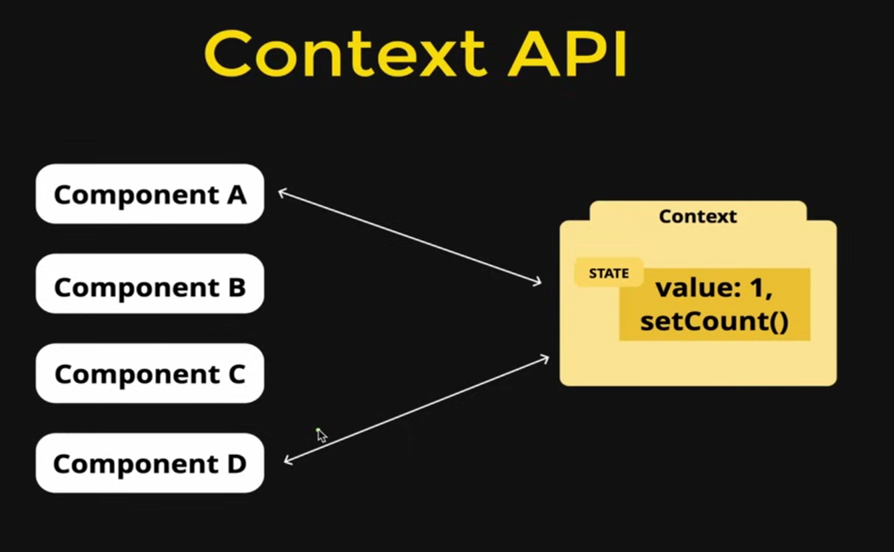
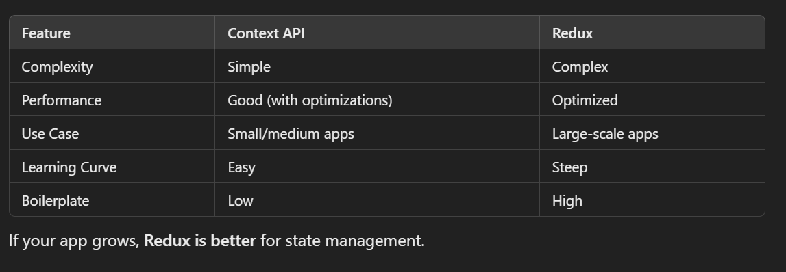

# React Context API

## 📌Why do we need Context API

```
The Context API in React is a built-in state management tool that allows you to share data (state) across multiple components without manually passing props (prop drilling). It provides a way to pass data through the component tree without having to pass props down manually at every level.
```

```
✔ Avoids prop drilling (passing props through multiple layers).
✔ Makes state management easier in large applications.
✔ Ideal for theme, authentication, user data, and global state.
✔ Alternative to Redux, Recoil, Zustand, and other state management libraries.
```


## 👉 How Does the Context API Work?
The Context API consists of three key components:

```
1️⃣ createContext() → Creates a new context.
2️⃣ Provider (Context.Provider) → Supplies the data to child components.
3️⃣ Consumer (useContext() or Context.Consumer) → Retrieves the data from the context.
```


We have to wrap up those components in `Context Provider`  which are need to excess the global context


## 🚀 Step-by-Step Implementation of Context API 🚀

### 📝 Step 1: Create a New Context

#### First, create a new file for the context (e.g., MyContext.js).

```jsx
import { createContext } from "react";

// Creating a Context
const MyContext = createContext(null);

export default MyContext;
```

### 📝 Step 2: Create a Context Provider

#### The provider is responsible for holding and sharing the state.

```jsx

import React, { useState } from "react";
import MyContext from "./MyContext";

const MyProvider = ({ children }) => {
  // Define the shared state
  const [user, setUser] = useState({ name: "Abhishek", age: 22 });

  return (
    <MyContext.Provider value={{ user, setUser }}>
      {children}
    </MyContext.Provider>
  );
};

export default MyProvider;
```
🔹 What’s happening here?

We created a user state with useState.

We provided user and setUser to the entire app using `<MyContext.Provider>`.

### 📝 Step 3: Wrap the App with the Provider
#### Wrap the App.js inside MyProvider so that all components can access the context.

```jsx
import React from "react";
import ReactDOM from "react-dom";
import App from "./App";
import MyProvider from "./MyProvider";

ReactDOM.render(
  <MyProvider>
    <App />
  </MyProvider>,
  document.getElementById("root")
);
```

`Now, all components inside App can access user and setUser.`

### 📝 Step 4: Consume the Context in a Component
#### Use the useContext() hook in a functional component to access the context.

```jsx
import { useContext } from "react";
import MyContext from "./MyContext";

const UserProfile = () => {
  // Access the context
  const { user, setUser } = useContext(MyContext);

  return (
    <div>
      <h2>Name: {user.name}</h2>
      <h3>Age: {user.age}</h3>
      <button onClick={() => setUser({ ...user, age: user.age + 1 })}>
        Increase Age
      </button>
    </div>
  );
};

export default UserProfile;
```

🔹 What’s happening here?

`useContext(MyContext) is used to retrieve user and setUser.`

`A button updates the age when clicked.`

### 📝 Step 5: Use the Component Inside App.js

```jsx
import UserProfile from "./UserProfile";

function App() {
  return (
    <div>
      <h1>React Context API Example</h1>
      <UserProfile />
    </div>
  );
}

export default App;
```

`✅ Now, the UserProfile component can access the user data globally.`

## 🔥 Advanced Concepts of Context API

### ✅ 1️⃣ Using Multiple Contexts
#### You can create multiple contexts for different types of data.

```jsx
const ThemeContext = createContext("light");
const AuthContext = createContext(null);
```

#### Then use multiple providers:

```jsx
<AuthContext.Provider value={authData}>
  <ThemeContext.Provider value={themeData}>
    <App />
  </ThemeContext.Provider>
</AuthContext.Provider>
```

#### To consume multiple contexts:

```jsx
const auth = useContext(AuthContext);
const theme = useContext(ThemeContext);
```


# ✅ 2️⃣ Context API vs Redux



# ✅ 3️⃣ Performance Optimization

## Problem:
### Context re-renders all consumers whenever the state updates.

## Solution:
### Use memoization (useMemo) and separate providers.

```jsx
const value = useMemo(() => ({ user, setUser }), [user]);
<MyContext.Provider value={value}>{children}</MyContext.Provider>;
```

# 🎯 Summary of Context API
## Step:-
```md
1.	Create a context (createContext)
2.	Create a provider component (Context.Provider)
3.	Wrap the app with the provider
4.	Consume context using useContext() or Context.Consumer
```
# 🔥 Final Thoughts
```
✅ The Context API is great for small and medium-scale apps.
✅ It avoids prop drilling and simplifies state management.
✅ Use Redux or Zustand for complex applications.
```

# 🔥 ShortCut File (Standard Practice)

## Standard practice for creating context 

```js
import { createContext, useContext } from "react";

export const TodoContext = createContext({
    todos: [
        {
            id: 1,
            todo: "Todo Message",
            completed: false,
        }
    ],
    addTodo: (todo) => {},
    updateTodo: (id, todo) => {},
    deleteTodo: (id) => {},
    toggleComplete: (id) => {}
});

export const useTodoContext = () =>{
    return useContext(TodoContext)
}

export const TodoContextProvider = TodoContext.Provider
```

## Using This Context In App (`Wrap Up App Component In Provider`)

```jsx
import { useEffect, useState } from "react";
import { TodoContextProvider } from "./context";
import TodoForm from "./components/TodoForm";
import TodoItem from "./components/TodoItem";

function App() {
  const [todos, setTodos] = useState([]);

  const addTodo = (todo) => {
    setTodos((prev) => [{ id: Date.now(), ...todo }, ...prev]);
  };

  const updateTodo = (id, todo) => {
    setTodos((prev) =>
      prev.map((prevTodo) => (prevTodo.id === id ? todo : prevTodo))
    );
  };

  const deleteTodo = (id) => {
    setTodos((prev) => prev.filter((prevTodo) => prevTodo.id !== id));
  };

  const toggleComplete = (id) => {
    setTodos((prev) =>
      prev.map((prevTodo) =>
        prevTodo.id === id
          ? { ...prevTodo, completed: !prevTodo.completed }
          : prevTodo
      )
    );
  };

  useEffect(() => {
    const todos = JSON.parse(localStorage.getItem("todos"));

    if (todos && todos.length > 0) {
      setTodos(todos);
    }
  }, []);

  useEffect(() => {
    localStorage.setItem("todos", JSON.stringify(todos));
  }, [todos]);

  return (
    <TodoContextProvider
      value={{ todos, addTodo, updateTodo, deleteTodo, toggleComplete }}
    >
      <div className="bg-[#172842] min-h-screen py-8">
        <div className="w-full max-w-2xl mx-auto shadow-md rounded-lg px-4 py-3 text-white">
          <h1 className="text-2xl font-bold text-center mb-8 mt-2">
            Manage Your Todos
          </h1>
          <div className="mb-4">
            {/* Todo form goes here */}
            <TodoForm />
          </div>
          <div className="flex flex-wrap gap-y-3">
            {/*Loop and Add TodoItem here */}
            {todos.map((todo) => (
              <div key={todo.id}>
                <TodoItem todo={todo}/>
              </div>
            ))}
          </div>
        </div>
      </div>
    </TodoContextProvider>
  );
}

export default App;
```